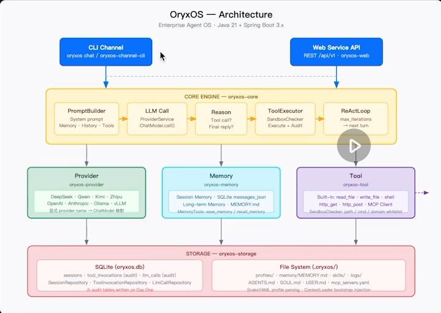

<div align="center">

<p align="center">
  
</p>

# OryxOS

**企业能完全掌控的、Java 原生的、私有可审计的 Agent OS**

装在你自己的 K8s 或服务器上，作为统一底座跑起运维助手、客服助手、HR 助手、销售助手、知识管理助手……数据不出企业，模型不锁生态。

[](#license)
[](#技术栈)
[](#技术栈)
[](#项目状态)
[](#贡献指南)

[核心能力](#核心能力) · [架构](#架构) · [快速开始](#快速开始) · [安全设计](#安全设计) · [路线图](#路线图) · [文档](#文档) · [贡献](#贡献指南)

</div>

---

## 目录

- [OryxOS 是什么](#oryxos-是什么)
- [为什么是 OryxOS](#为什么是-oryxos)
- [核心能力](#核心能力)
- [架构](#架构)
- [典型场景](#典型场景)
- [快速开始](#快速开始)
- [命令一览](#命令一览)
- [安全设计](#安全设计)
- [项目状态](#项目状态)
- [路线图](#路线图)
- [技术栈](#技术栈)
- [OryxOS 不是什么](#oryxos-不是什么)
- [文档](#文档)
- [贡献指南](#贡献指南)
- [社区与生态](#社区与生态)
- [License](#license)

---

## OryxOS 是什么

**OryxOS** 是基于 Java 实现的、面向企业场景的 **Agent OS**。

它装在企业自己的 K8s、服务器或物理机上，作为统一底座，在底座之上跑各种业务 Agent（运维助手、客服助手、HR 助手、销售助手、知识管理助手等），共享一套渠道接入、模型路由、工具调用、记忆系统、沙箱执行能力。**数据完全留在企业自己的基础设施上，不锁定任何云生态。**

业界已经有开源项目验证过这套设计（[OpenClaw](https://github.com/openclaw/openclaw) 用 Node.js、[Hermes Agent](https://github.com/NousResearch/hermes-agent) 用 Python），但 Java 生态里从来没有项目把"Agent OS"作为自己的定位。Java 是大量企业现有后端的事实标准技术栈，[Spring AI Alibaba](https://java2ai.com) 已经把底层 LLM 调用解决了，缺的就是上面那一层"Agent OS"。**OryxOS 填这个位置。**

> **Agent OS 跟 agent runtime 不是一回事。**
> agent runtime 是让单个 Agent 跑起来的执行内核（LLM 调用、工具执行、上下文管理、循环控制）。Agent OS 在 runtime 之上，还要管一群 Agent 的生命周期、统一的对外对内接入、统一记忆、多租户、审计这些 OS 级治理能力。
> 一句话：**runtime 让一个 Agent 跑起来，Agent OS 让一群 Agent 在企业里被管起来。**

OryxOS 的交付分两段：

- **核心阶段**（当前）：把 Agent OS 的**运行时内核**用 Java 做扎实，能力上对齐业界开源 Agent OS 的基础层。
- **企业级治理层**（多租户、SSO、完整审计、Tool Policy、Web 仪表板）：由扩展阶段和开源社区共建陆续补齐，是 OryxOS 真正的差异化终局。

核心阶段是地基，企业级治理是终局。

---

## 为什么是 OryxOS

企业真正的刚需不是"Agent OS 这个品类"，而是**一个私有、可控、可审计的 Agent 统一底座**。尤其是银行、政府、电信、能源、医疗这类严监管企业，有几条不会变的铁律：

- 核心业务数据不能出企业
- 系统必须完全可审计
- 任何新组件都要过现有的安全和合规流程
- 技术栈要跟现有体系对齐

这几条铁律直接排除了 SaaS 化的 Agent 产品、锁定某个公有云生态的方案，也很难把一个有 CVE 历史、默认权限宽松的开源项目直接放进生产。而 OpenClaw、Hermes 都偏个人到小团队定位，企业级治理（多租户 RBAC、SSO、完整审计架构）仍是空白；两者也都不是 Java，跟企业现有的 Java 后端、运维工具链（Nacos、Sentinel、SkyWalking、Arthas）之间总要写一层脆弱的跨语言胶水代码。

OryxOS 把自己锚在这个不会变的需求上：**私有部署、完全可审计、Java 原生对齐、数据不出企业、IT 能掌控。**

四个词概括设计目标：

| 目标 | 含义 |
|---|---|
| **统一** | 企业内多个业务 Agent 共享同一套底座，Channel、Provider、Tool、Memory、Sandbox 下沉到 OryxOS |
| **私有** | 数据完全留在企业自己的基础设施，模型可接外部 API 也可用本地 Ollama / vLLM |
| **易接入** | 标准 Spring Boot 工程结构，跟企业现有 ERP/CRM/CMDB/SSO/监控系统直接对接 |
| **可观测** | 标准 Prometheus 指标、结构化 JSON 日志、健康检查接口，适配企业现有监控告警体系 |

更完整的领域判断和竞品分析见 [业界调研文档](docs/IndustryResearch.md)。

---

## 核心能力

核心阶段优先做五个能力，都属于"让单个 Agent 跑得好"的运行时内核层。基于这五个能力可以组合出企业里大量真实需求，OryxOS 本身不绑定具体业务。

| # | 能力 | 一句话 |
|---|---|---|
| 1 | **对接 LLM** | 通过 Provider 抽象对接 DeepSeek、通义、Kimi、智谱、混元、豆包、Anthropic、OpenAI 等主流大模型，Agent 不感知具体调的是哪家，运行时切换无 lock-in |
| 2 | **ReAct 循环** | Agent 的核心工作机制：LLM 思考是否调用工具、调用后看结果、再决定下一步，直到给出最终响应 |
| 3 | **Memory 三层记忆** | 会话记忆 + 长期记忆（默认 `MEMORY.md`；007 规划 SQLite / 自托管 Mem0 可选后端）+ 情景记忆（扩展阶段） |
| 4 | **Tool 体系** | 内置文件 / Shell / HTTP 工具，Plugin Tool 三档接入：零代码写 `SKILL.md` 复用 MCP、轻代码自写 MCP server、重代码 `@Tool` 注解写 Spring Bean |
| 5 | **Web Service** | 完整 REST API 对外暴露，业务系统一句 HTTP 调用就能用上 Agent，是企业把 AI 能力嵌入已有系统的唯一通道 |

五个能力像五个齿轮，组合起来就是全渠道客服、运维助手、研发助手、知识管理、销售助手、数据分析等场景——这些场景不需要 OryxOS 单独做模块，业务方在 OryxOS 上配 Profile、写 Plugin Tool、调 Web Service 就能落地。

完整的功能分级（核心 / 扩展 / 社区共建）见 [需求分析文档](docs/DemandAnalysis.md)。

---

## 架构

OryxOS 是一个 Spring Boot 3.x 单体应用，跑在 JDK 21 上。对外只有两个入口（CLI Channel、Web Service REST API），消息最终都汇入同一个引擎 **ReAct 循环**，由它调度 Provider（LLM 调用）、Memory（上下文）、Tool（执行）三块能力。

<p align="center">
  
</p>

<p align="center">
  <sub>矢量版：<a href="docs/images/architecture.svg"><code>architecture.svg</code></a></sub>
</p>

关键技术决策（详见 [技术方案文档](docs/TechnicalSolution.md) 第 1 章）：

- **自己实现 ReAct loop**，不依赖 Spring AI 的 Agent 抽象，核心循环约数十行 Java，完整可控
- **Spring AI 只用一半**：只用它的 Provider 协议转换和 `@Tool` 的 Schema 生成，禁用其自动 tool 执行，调度完全由 OryxOS 自己的 `ToolExecutor` 控制
- **同步阻塞 + Java 21 virtual thread**，代码直观又能扛住高并发
- **Sandbox 用 Path/Pattern 白名单**，不用已在 JDK 21 废弃的 `SecurityManager`
- **SQLite 保存 Session/审计，长期记忆默认 `MEMORY.md`**；007 默认兼容已提交，SQLite 长期后端本地验收通过，自托管 Mem0 尚未实现，不改变默认本地运行方式

工程上是 **Maven 多模块（9 个模块）**：`oryxos-core`（引擎）、`oryxos-provider`（能力一）、`oryxos-memory`（能力三）、`oryxos-tool`（能力四）、`oryxos-web`（能力五）、`oryxos-channel-cli`、`oryxos-storage`、`oryxos-cli`、`oryxos-boot`。

---

## 典型场景

<details>
<summary><b>运维助手</b> —— 凌晨告警自愈，早晨看报告</summary>

某中型 SaaS 公司的运维团队基于 OryxOS 搭一个运维助手，接入企业微信。凌晨告警通过 webhook 进 OryxOS，Agent 调用日志查询 Tool 拉错误堆栈，跟历史故障库交叉引用发现是已知 bug，自动应用 mitigation Skill 重启服务，在企业微信运维群里汇报"已自愈，详情见附件"。

</details>

<details>
<summary><b>知识管理助手</b> —— 合规问答，引用可追溯</summary>

某金融企业法务团队基于 OryxOS 搭知识管理 Agent，接入飞书，索引内部合同模板、法规文档、历史案例。员工问"上次签 SaaS 服务协议是怎么处理数据出境条款的"，Agent 检索 Memory 拉出历史案例，综合法规给出建议草稿并标注引用来源。

</details>

<details>
<summary><b>销售助手</b> —— 拜访前一分钟看懂客户</summary>

某制造业企业销售部门基于 OryxOS 搭客户洞察 Agent，接入企业微信和 CRM。销售问"明天去拜访 A 公司，有什么我需要知道的"，Agent 调用 CRM connector 拉历史交易记录、调企查查 MCP 查工商信息、调知识库提取关键决策人和采购习惯，综合输出客户简报。

</details>

更多场景细节见 [需求分析文档 · 第 4 章](docs/DemandAnalysis.md)。

---

## 快速开始

> ⚠️ Maven 多模块骨架已可编译打包；Agent 运行时能力仍在核心阶段实现中。下面命令中，`init` 已可用，其余为成形后的目标体验。详见 [项目状态](#项目状态)。

```bash
# 1. 在你的项目目录下初始化 OryxOS 工作区
oryxos init

# 2. 编辑默认 Profile，填入你的 LLM API Key
vim .oryxos/profiles/default.yaml

# 3. 启动交互式对话
oryxos chat

# 或者：以服务模式启动，把 Agent 能力通过 REST API 暴露出去
oryxos serve --port 8080
```

`oryxos init` 会创建 `.oryxos/` 工作目录，包含六个子目录：`profiles/`、`sessions/`、`skills/`、`logs/`、`tools/`、`memory/`，以及 `AGENTS.md` / `SOUL.md` / `USER.md`、`memory/MEMORY.md`、`mcp_servers.yaml`、空的 `oryxos.db` 占位，和一份可直接对话的默认 Profile。SQLite 三张表（`sessions` / `tool_invocations` / `llm_calls`）在首次启动 Spring 的命令（`chat` / `serve`）时由 `db/schema.sql` 初始化。

---

## 命令一览

OryxOS 通过命令行工具完成主要操作，核心阶段共 12 个命令。三种运行模式（`chat` / `serve` / `gateway`）共享同一份 Profile 配置和 Session 存储。

| 命令 | 说明 |
|---|---|
| `oryxos init` | 初始化 `.oryxos/` 工作区 |
| `oryxos status` | 查看配置和运行状态 |
| `oryxos chat` | 交互式多轮对话（`--profile` 指定 Agent，`--message` 单条消息后退出） |
| `oryxos serve` | 启动 HTTP API 服务（默认端口 8080） |
| `oryxos gateway` | 启动多渠道守护进程 |
| `oryxos profile list` | 列出所有 Profile |
| `oryxos profile create <name>` | 创建新 Profile |
| `oryxos profile show <name>` | 查看 Profile 详情 |
| `oryxos profile delete <name>` | 删除 Profile |
| `oryxos provider list` | 列出已配置的 Provider |
| `oryxos tool list` | 列出已注册的 Tool |
| `oryxos session list` | 列出会话历史 |

对外的 REST API 覆盖会话管理、Agent 调用、Profile/Memory/Tool 信息查询、系统状态六类操作，核心阶段先提供 10 个关键端点（`POST /api/v1/sessions`、`POST /api/v1/sessions/{id}/messages`、`GET/DELETE /api/v1/sessions/{id}`、`POST /api/v1/agents/{name}/invoke`、`GET /api/v1/profiles`、`GET /api/v1/memory`、`GET /api/v1/tools`、`GET /api/v1/health`、`GET /api/v1/info`）。

---

## 安全设计

OryxOS 定位严监管企业，**安全是 day one 的架构设计，不是事后打补丁**。这一点上刻意跟 OpenClaw 走相反的路——OpenClaw 的 CVE、恶意 skill、凭证收割等问题不是偶然 bug，而是"开放低门槛 skill 生态 + 默认宽松权限 + 弱隔离"的结构性后果。OryxOS 的安全取向：

| 原则 | 做法 |
|---|---|
| **Skill/Tool 来源受控** | 不做"任何人上传、任何 Agent 随意拉取"的开放市场，企业内 Skill/Tool 经注册、审核、版本管理，来源可追溯 |
| **最小权限** | 每个 Agent、每个 Tool 拿到的是显式授予的最小集合，文件/网络/Shell 访问默认收紧、按需放开 |
| **沙箱隔离** | Tool 在隔离环境执行，有明确资源和能力边界（核心阶段应用层白名单，扩展阶段 Docker/K8s pod 容器级隔离） |
| **凭证不落地** | API key、token 不硬编码、不明文存储，对接企业 KMS/Vault，凭证使用全程可审计 |
| **全链路审计** | 谁、何时、让哪个 Agent、调了什么 Tool、访问了什么数据、产生什么结果，全程结构化留痕，可接入企业 SIEM |
| **数据不外发** | OryxOS 本身不收集、不主动外发任何企业数据，这是硬约束 |

> ⚠️ **核心阶段的安全边界**：核心阶段的 Tool 隔离是**应用层白名单校验**（文件路径、Shell 命令、HTTP 域名白名单），不是完整容器级沙箱，因此**核心阶段不建议在生产环境跑高敏感场景**。完整的鉴权、Docker Sandbox 隔离、SSO 集成、多租户、RBAC、完整审计查询在扩展阶段补齐。

完整的安全设计论述见 [业界调研文档 · 5.6 节](docs/IndustryResearch.md)。

---

## 项目状态

OryxOS 目前处于**核心阶段实施中**：Maven 9 模块与 fat JAR 已就绪；006 文件式 Memory 已归档提交（`3d60ee0`）。007 已进入实现，默认 Markdown 兼容已在 `2a63e58` 提交，SQLite 后端本地验收通过；获准的外部受控 Mem0 适配及 HTTP 白名单尚未实现，整个007未封板，详见 [007 验收台账](specs/007-memory-backends/acceptance.md)。

核心阶段目标：用 4 周 / 12 小时的最短链路，交付一个可演示的最小完整 Agent OS **运行时内核**——配置一个 Agent、通过 CLI 跟它对话、它能调用 LLM 和工具完成任务，并能通过 REST API 对外暴露。企业级治理能力（多租户、SSO、完整审计、Tool Policy）不在这一阶段范围内，由扩展阶段和社区接力补齐。

| 周次 | 核心能力 | 周末可演示成果 |
|---|---|---|
| 第一周 | 对接 LLM + ReAct 循环 | Agent 能多轮对话并调 HTTP Tool 完成简单任务 |
| 第二周 | Memory + Tool 体系 | Agent 能记住偏好、调文件读写、调外部 MCP 工具 |
| 第三周 | Web Service | 外部系统能通过 10 个 REST 端点调用 OryxOS |
| 第四周 | 多 Agent 演示 + 工程化收尾 | 多 Agent 并存、CLI 完整、Session 跨重启恢复、主页可访问 |

五个验收 Demo（查天气写日报 / 跨对话记偏好 / 零代码 PR digest / Web Service 同步调用 / 多端点联动）跑通是核心功能发布的硬条件，详见 [需求分析文档 · 第 13 章](docs/DemandAnalysis.md)。

---

## 路线图

- [x] 业界调研 / 需求分析 / 技术方案 / AI 编程实施指南
- [ ] **核心阶段**：五大能力运行时内核（对接 LLM、ReAct 循环、Memory、Tool、Web Service）
- [ ] **007 核心范围扩张**：默认 Markdown 兼容 + SQLite 长期记忆 + 显式可选自托管 Mem0；数据路径、安全接线和服务协议通过核验后才实现
- [ ] **扩展阶段**：多 Channel（企业微信/飞书/钉钉/Slack）、Provider Fallback、自建 Memory 向量索引、情景记忆、Skill 体系、MCP Server 暴露、Tool Policy、完整 Sandbox（Docker/K8s pod）、Web 仪表板、SSO 与多租户、完整审计、集群高可用、企业 IT 系统 connector
- [ ] **社区共建**：Skills Marketplace、多语言 SDK、可视化 Profile 编辑器、Kubernetes Operator、移动端管理台、Voice Channel、RISC-V/边缘部署

远期愿景是从单机私有部署演进到底座分布式部署，再到跨节点的分布式 Agent 协作，详见 [业界调研文档 · 第六章](docs/IndustryResearch.md)。

---

## 技术栈

| 分类 | 选型 |
|---|---|
| 语言 / 运行时 | JDK 21+ |
| 应用框架 | Spring Boot 3.x（单体，virtual thread） |
| LLM 调用 | Spring AI + Spring AI Alibaba |
| Agent 核心 | 自实现 ReAct loop |
| Web 层 | Spring MVC |
| 命令行 | Picocli |
| 配置解析 | SnakeYAML |
| 持久化 | 已有 SQLite + Spring Data JPA（Session/审计）与默认 `MEMORY.md`；007 规划 `memory_entries` / 自托管 Mem0 可选长期后端 |
| 外部工具集成 | MCP Java SDK（Model Context Protocol） |
| 日志 | Logback + SLF4J |
| 可观测性（扩展阶段） | Micrometer + Prometheus |

---

## OryxOS 不是什么

| | 框架<br>(LangChain / Spring AI / LangChain4j) | 编排平台<br>(Dify / Coze) | **OryxOS** |
|---|---|---|---|
| 产物 | 代码 | 一条 workflow | 配置出来的常驻 Agent |
| 谁来用 | 开发者写代码 | 业务人员拖拽 | 业务方配置 Agent、写 Tool |
| 运行环境 | 自己搭 | 平台提供 | 自带，装好就跑 |
| 跟 OryxOS 的关系 | 被复用（做 LLM 调用） | 可跑在 OryxOS 之上 | 它自己 |

框架给你材料自己盖房子，编排平台给你流程跑在运行时之上，OryxOS 给你的是运行时本身——一个让 Agent 能常驻、可治理、可审计地跑起来的底座。OryxOS 复用 Spring AI 做底层 LLM 调用，也托得住 Dify 之类的编排平台在它之上运行，自己专注守在"运行时"这一层，不做可视化编排、不做复杂多 Agent 显式协作。

跟 OpenClaw、Hermes Agent 是同类不同定位的关系：三者都是 Agent OS，OpenClaw 偏个人（Node.js）、Hermes 偏个人到小团队（Python）、OryxOS 直接定位严监管企业场景（Java）。Skill 体系上通过 `SKILL.md` 兼容 [agentskills.io](https://agentskills.io) 开放标准，生态互补不竞争。

---

## 文档

| 文档 | 内容 |
|---|---|
| [`docs/IndustryResearch.md`](docs/IndustryResearch.md) | 业界调研：Agent OS 是什么、OpenClaw/Hermes 分析、Java 生态缺位、OryxOS 定位与愿景 |
| [`docs/DemandAnalysis.md`](docs/DemandAnalysis.md) | 需求分析：功能分级、术语、设计目标、数据模型、验收标准 |
| [`docs/TechnicalSolution.md`](docs/TechnicalSolution.md) | 技术方案：架构、关键技术决策、模块设计、数据持久化、实施节奏 |
| [`docs/AiProgrammingGuide.md`](docs/AiProgrammingGuide.md) | AI 编程实施指南：Spec-Kit 拆解、5 个 user story、增量阶段协作模式 |
| [`AGENTS.md`](AGENTS.md) | 面向 Claude Code / Codex / Cursor 的统一 Agent 指令（`CLAUDE.md` 为其软链） |
| [`.agents/`](.agents/) | 跨工具 Skills 标准目录（`.claude/skills`、`.cursor/skills` 软链至此） |

API 参考文档、部署运维手册、贡献者指南、场景使用手册等作为社区共建项目，随项目推进逐步补齐。

---

## 贡献指南

OryxOS 核心阶段之后将以开源社区方式长期维护。主仓库会用清晰的 issue 标注区分 `good-first-issue`（适合新贡献者）、`feature-request`（扩展功能）、`long-term-goal`（社区共建长期方向）。

在正式的 `CONTRIBUTING.md` 就位前，参与方式建议：

1. 阅读 [`docs/`](docs) 下四份文档和 [`AGENTS.md`](AGENTS.md)（或软链 [`CLAUDE.md`](CLAUDE.md)），理解核心阶段的边界（运行时内核）和扩展阶段的边界（治理层）
2. 若克隆后软链失效，运行 `pwsh -File scripts/link-agents.ps1`
2. Fork 仓库，认领一个 issue 或提出你的想法
3. 小颗粒度改动直接改代码提 PR；涉及新增模块或跨核心能力的大改动，建议先开 issue 讨论
4. 提 PR 前确认没有违反 [技术方案文档](docs/TechnicalSolution.md) 里的关键技术决策（尤其是"Spring AI 禁用自动 tool 执行"和"审计表 day one 落库"这两条最容易被忽略）

---

## 社区与生态

OryxOS 借鉴了 OpenClaw、Hermes Agent 已经验证过的设计哲学（Agent 配置化、Channel 抽象、三层记忆、Skill 体系、MCP 工具调用），在 Java 生态里重新实现，并补齐企业级治理能力。通过 `SKILL.md` 兼容 [agentskills.io](https://agentskills.io) 开放标准，社区的优质 Skill 经审查后理论上可以导入使用。

- [OpenClaw](https://github.com/openclaw/openclaw) — Node.js，偏个人和开发者场景
- [Hermes Agent](https://github.com/NousResearch/hermes-agent) — Python，偏个人到小团队
- [Spring AI Alibaba](https://java2ai.com) — OryxOS 的 LLM Provider 抽象基于它构建
- [Model Context Protocol](https://modelcontextprotocol.io) — OryxOS Tool 生态对接的标准协议

---

## License

计划采用 **MIT License**，与 OpenClaw、Hermes Agent 及 agentskills.io 生态保持一致，正式的 `LICENSE` 文件将随核心阶段推进添加。

---

<div align="center">

如果 OryxOS 的方向对你有价值，欢迎 Star 关注进展。

</div>
