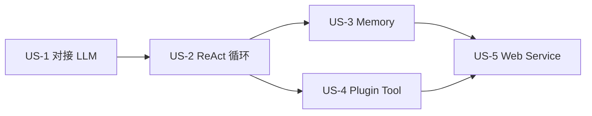

# OryxOS AI 编程实施指南

本文档定义 OryxOS 的 AI 编程实施思路。主体思路是用 Spec-Kit 完成主体开发，把已有的需求文档和技术方案喂给 Spec-Kit，按五大核心能力拆成 5 个 user story 逐步实施；后续增量阶段切换到手动提示词配合 Claude Code。

## 实施总览

OryxOS 的 AI 编程实施分两个阶段：

- **主体开发阶段**：从零开发 OryxOS 1.0 的五大核心能力。用 Spec-Kit 跑完整的 spec-driven 流程（constitution → specify → plan → tasks → implement），保证产出的代码跟需求文档对齐。
- **增量开发阶段**：扩展功能、修 bug、加 Plugin Tool 这些都是小颗粒度增量，每个增量 1 到 3 个文件改动。切换到手动提示词配合 Claude Code。

## User Story 拆解

整个 OryxOS 主体开发按 5 个 user story 组织，每个对应一个核心能力。

| User Story | 核心能力 | 依赖 | 对应验收 Demo |
|------------|----------|------|---------------|
| US-1 | 对接 LLM | 无（基础） | （与 US-2 合并）Demo 一 |
| US-2 | ReAct 循环 | US-1 | Demo 一（查天气穿衣） |
| US-3 | Memory 三层记忆 | US-2 | Demo 二（跨对话记偏好） |
| US-4 | Plugin Tool 体系 | US-2（与 US-3 并行） | Demo 三（零代码 PR digest） |
| US-5 | Web Service | 前 4 个 | Demo 四 + 五（同步调用、多端点联动） |

推进顺序：**US-1 → US-2 →（US-3 ∥ US-4）→ US-5**

## Constitution 非协商原则

1. JDK 21 + Spring Boot 3.x 单体应用，Maven 多模块（9 个），单二进制部署
2. 五大核心能力优先，支撑模块次之；核心阶段交付运行时内核，企业级治理层放扩展阶段
3. 自实现 ReAct loop，不直接用 Spring AI 的 Agent 抽象
4. **Spring AI 只用一半**：只用它的 Provider 抽象、协议转换和 `@Tool` 的 schema 生成，禁用它的自动 tool 执行
5. Plugin Tool 三档接入，主推 `SKILL.md` 加 MCP 零代码方式
6. 核心阶段 SQLite 加 `MEMORY.md` 文件存储；审计相关的 `tool_invocations` 和 `llm_calls` 核心阶段就写入落库
7. 每个 user story 完成后有可演示 demo，优先级是跑通而非完美

## 实施纪律

- **版本锁定 Spec-Kit**：实施前锁定 Specify CLI 一个版本号，主体开发期间不升级
- **跨 user story 上下文别丢**：每个 user story 开始前重读 `spec.md` + `plan.md` + 最近代码
- **US-2 的 Session 是内存版**，到 US-5 才升级成 SQLite 持久化；`SandboxChecker` 在 US-2 是只校验 URL 的简化版，到 US-4 补齐完整版
- **MCP 集成先测连通性**：Java MCP Client 生态成熟度不如 Python，stdio transport 可能遇到进程启动失败、stdin/stdout 编码问题
- **每个 user story 结束后跑 `/speckit.analyze`**，并 git commit 标记完成

## 项目交付物

- **项目主页**：VitePress 静态站点，跟核心代码同期发布
- **Spec-Kit artifacts 保留**：`constitution.md`、`spec.md`、`plan.md` 作为社区接力的长期参考
- **社区文档**：API 参考文档、部署运维手册、贡献者指南作为社区共建项目

## 完整文档

> 📄 完整实施指南文档约 3 万字，包含详细的 Spec-Kit 匹配度评估、任务拆分和协作模式。

**[在 GitHub 上查看完整文档](https://github.com/XiaoDHuang/oryxos/blob/main/docs/AiProgrammingGuide.md)**
