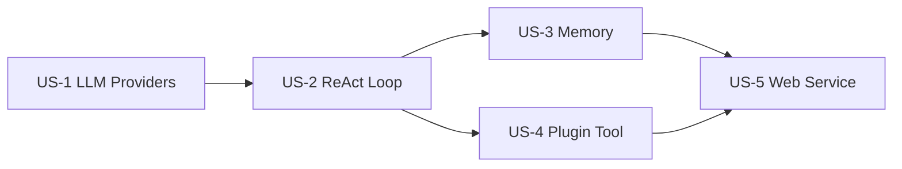

# OryxOS AI Programming Guide

This document defines the AI programming implementation approach for OryxOS. The main idea is to use Spec-Kit for the main development, feeding the existing demand and technical solution documents into Spec-Kit, breaking down the five core capabilities into 5 user stories for step-by-step implementation; then switching to manual prompts with Claude Code for the incremental phase.

## Implementation Overview

OryxOS's AI programming implementation is divided into two phases:

- **Main development phase**: Develop OryxOS 1.0's five core capabilities from scratch. Use Spec-Kit to run the complete spec-driven process (constitution → specify → plan → tasks → implement), ensuring the output code aligns with the demand document.
- **Incremental development phase**: Extension features, bug fixes, adding Plugin Tools — these are small-granularity increments, typically 1–3 file changes per increment. Switch to manual prompts with Claude Code.

## User Story Breakdown

The entire OryxOS main development is organized into 5 user stories, each corresponding to one core capability.

| User Story | Core Capability | Dependencies | Acceptance Demo |
|------------|----------|------|---------------|
| US-1 | LLM Providers | None (foundation) | (Merged with US-2) Demo 1 |
| US-2 | ReAct Loop | US-1 | Demo 1 (weather + clothing) |
| US-3 | Three-Layer Memory | US-2 | Demo 2 (cross-dialogue preferences) |
| US-4 | Plugin Tool System | US-2 (parallel with US-3) | Demo 3 (zero-code PR digest) |
| US-5 | Web Service | All previous | Demo 4 + 5 (sync call, multi-endpoint) |

Progression order: **US-1 → US-2 → (US-3 ∥ US-4) → US-5**

## Constitution — Non-Negotiable Principles

1. JDK 21 + Spring Boot 3.x monolithic application, Maven multi-module (9 modules), single binary deployment
2. Five core capabilities take priority over support modules; core phase delivers the runtime kernel, enterprise governance layer goes to extension phase
3. Self-implemented ReAct loop, not using Spring AI's Agent abstraction
4. **Use Spring AI only half**: only its Provider abstraction, protocol conversion, and `@Tool` schema generation; automatic tool execution is disabled
5. Plugin Tool three access levels,主推 `SKILL.md` + MCP zero-code approach
6. Core phase uses SQLite + `MEMORY.md` file storage; audit-related `tool_invocations` and `llm_calls` are persisted from the core phase
7. Each user story ends with a demonstrable demo; priority is "making it work" over perfection

## Implementation Discipline

- **Lock Spec-Kit version**: Lock Specify CLI to a specific version before implementation; do not upgrade during main development
- **Don't lose cross-user-story context**: Re-read `spec.md` + `plan.md` + recent code before starting each user story
- **US-2 Session is in-memory**, upgraded to SQLite persistence only in US-5; `SandboxChecker` in US-2 is a simplified version validating only URLs, completed in US-4
- **Test MCP connectivity first**: Java MCP Client ecosystem maturity lags behind Python; stdio transport may encounter process startup failures and stdin/stdout encoding issues
- **Run `/speckit.analyze` after each user story**, and git commit to mark completion

## Deliverables

- **Project homepage**: VitePress static site, released alongside core code
- **Spec-Kit artifacts preserved**: `constitution.md`, `spec.md`, `plan.md` kept as long-term references for community handoff
- **Community documentation**: API reference, deployment/ops manual, contributor guide as community co-building projects

## Full Document

> 📄 The complete implementation guide document is approximately 30K characters, including detailed Spec-Kit fit assessment, task breakdown, and collaboration patterns.

**[View full document on GitHub](https://github.com/XiaoDHuang/oryxos/blob/main/docs/AiProgrammingGuide.md)**
